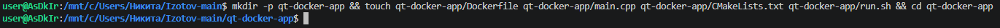
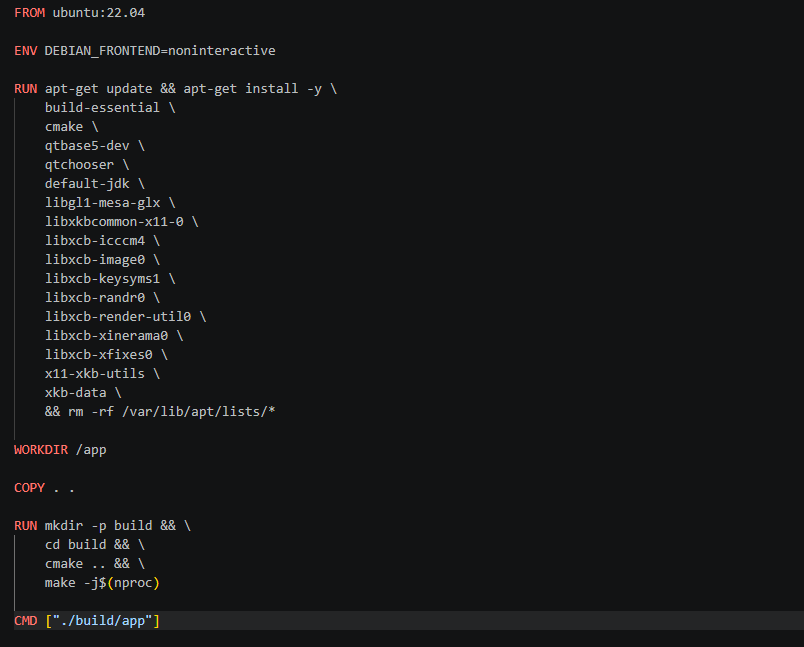
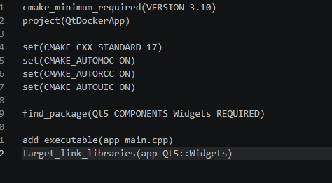
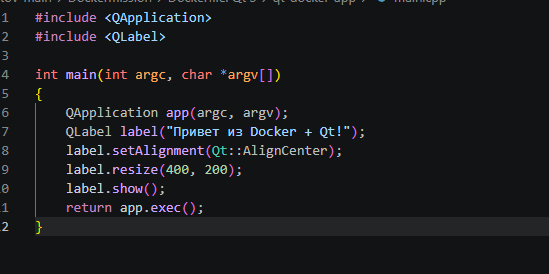
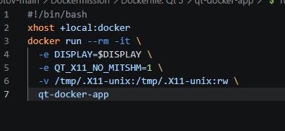
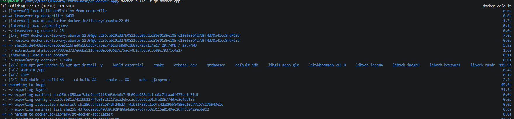
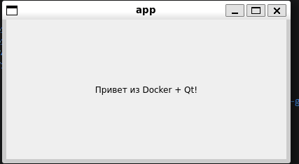

### 1. Структура проекта
```
qt-docker-app/
├── Dockerfile
├── main.cpp
├── CMakeLists.txt
└── run.sh
```

В **WSL/Ubuntu** создать одной bash-командой всю структуру для нового приложения:
```shell
mkdir -p qt-docker-app && touch qt-docker-app/Dockerfile qt-docker-app/main.cpp qt-docker-app/CMakeLists.txt qt-docker-app/run.sh && cd qt-docker-app
```


### 2. Содержимое файла `Dockerfile`
```dockerfile
FROM ubuntu:22.04

ENV DEBIAN_FRONTEND=noninteractive

RUN apt-get update && apt-get install -y \
    build-essential \
    cmake \
    qtbase5-dev \
    qtchooser \
    default-jdk \
    libgl1-mesa-glx \
    libxkbcommon-x11-0 \
    libxcb-icccm4 \
    libxcb-image0 \
    libxcb-keysyms1 \
    libxcb-randr0 \
    libxcb-render-util0 \
    libxcb-xinerama0 \
    libxcb-xfixes0 \
    x11-xkb-utils \
    xkb-data \
    && rm -rf /var/lib/apt/lists/*

WORKDIR /app

COPY . .

RUN mkdir -p build && \
    cd build && \
    cmake .. && \
    make -j$(nproc)

CMD ["./build/app"]
```


### 3. Содержимое файла `CMakeLists.txt`
```cmake
cmake_minimum_required(VERSION 3.10)
project(QtDockerApp)

set(CMAKE_CXX_STANDARD 17)
set(CMAKE_AUTOMOC ON)
set(CMAKE_AUTORCC ON)
set(CMAKE_AUTOUIC ON)

find_package(Qt5 COMPONENTS Widgets REQUIRED)

add_executable(app main.cpp)
target_link_libraries(app Qt5::Widgets)
```


### 4. Содержимое файла `main.cpp`
```cpp
#include <QApplication>
#include <QLabel>

int main(int argc, char *argv[])
{
    QApplication app(argc, argv);
    QLabel label("Привет из Docker + Qt!");
    label.setAlignment(Qt::AlignCenter);
    label.resize(400, 200);
    label.show();
    return app.exec();
}
```


### 5. Содержимое файла `run.sh` для Linux/WSL
```bash
#!/bin/bash
xhost +local:docker
docker run --rm -it \
  -e DISPLAY=$DISPLAY \
  -e QT_X11_NO_MITSHM=1 \
  -v /tmp/.X11-unix:/tmp/.X11-unix:rw \
  qt-docker-app
```


### 6. Сборка и запуск

В командной строке **VS Code+WSL**, находясь в папке `qt-simple`, выполнить:
```shell
docker build -t qt-docker-app .
```


Создание и запуск контейнера для **Linux/WSL (терминал Ubutnu)**
```shell
chmod +x run.sh
```
и
```shell
./run.sh
```

Создание и запуск контейнера для **macOS** (как в обычном Linux?)
```shell

```

После успешного запуска вы увидите окно приложения. Если окно не появляется, проверьте логи:
```shell
docker logs <container_id>
```