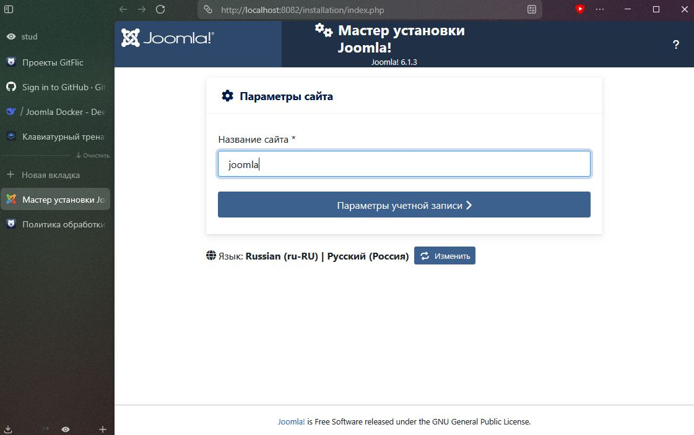
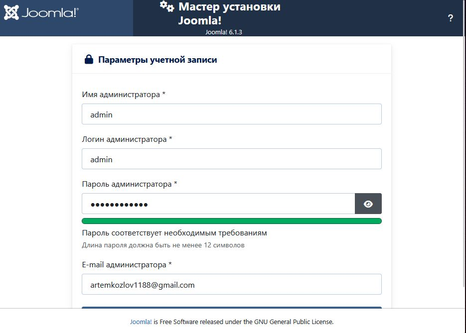
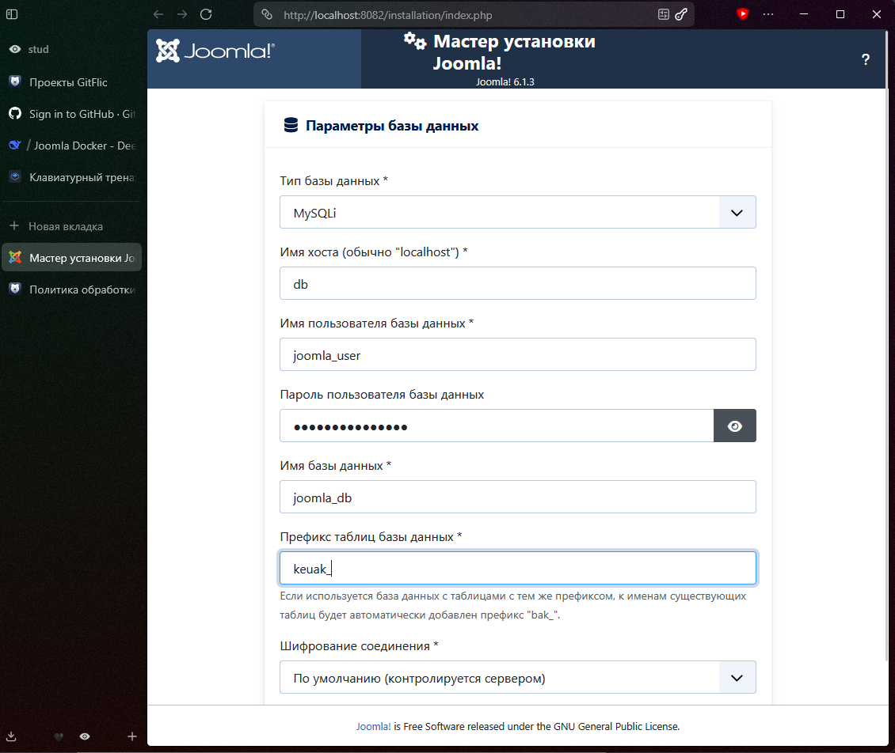
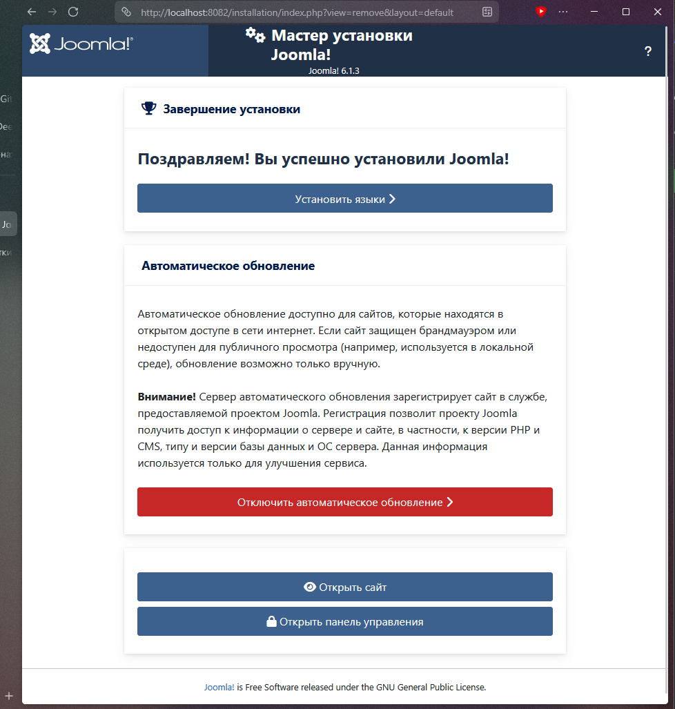
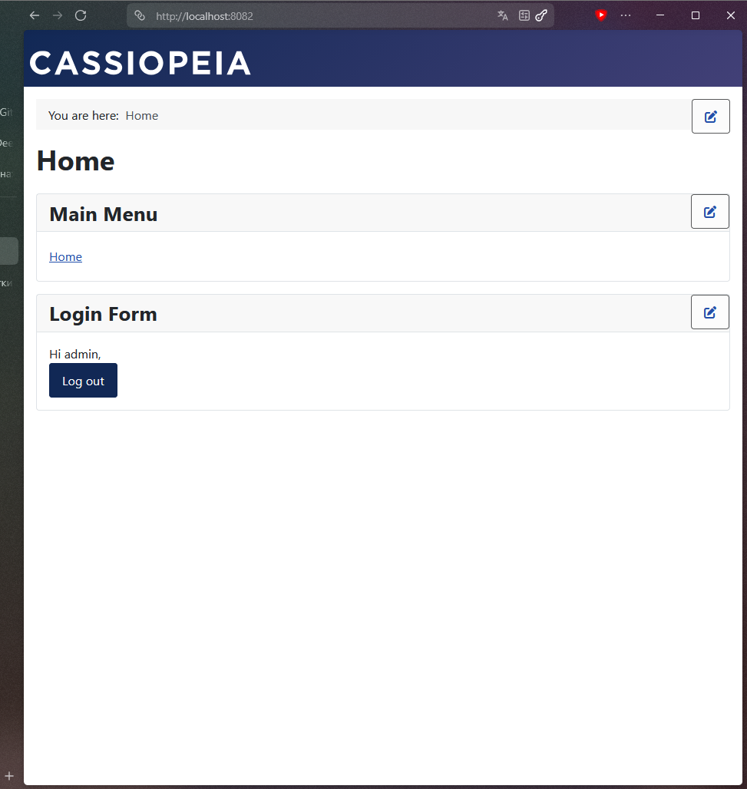
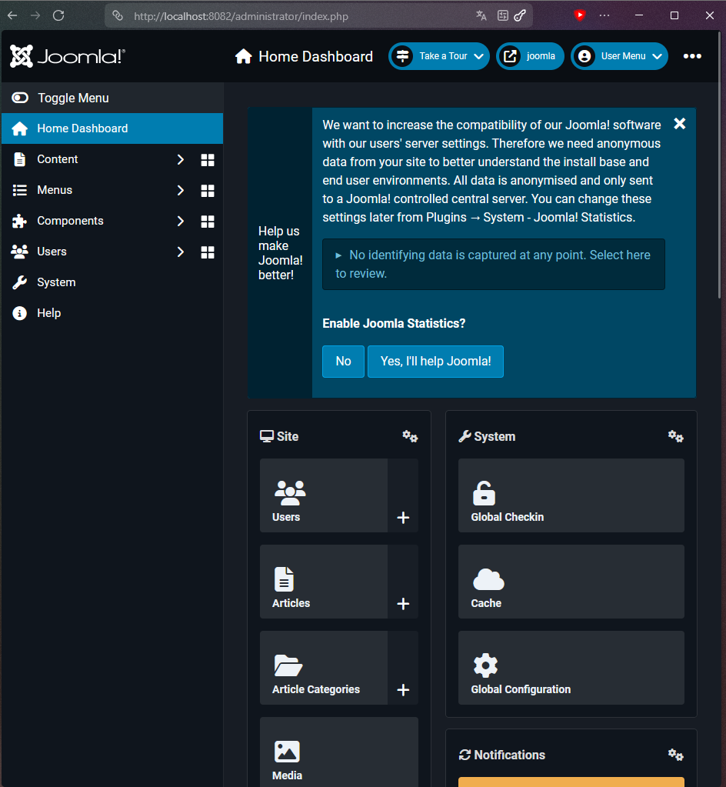

# Отчёт о выполнении практической работы

<div align="center">

## Docker Compose проект с Joomla

**Выполнил:** _[Козлов Артем]_
**Группа:** _[Ипо8482]_


</div>

---

## 1️⃣ Запуск проекта

```shell
docker compose up -d
```

Проверка статуса контейнеров:

```shell
docker compose ps -a
```

> 📸 **Скриншот 1 — запуск контейнеров и их статус:**


---

## 2️⃣ Установка Joomla через веб-установщик

Открыл в браузере адрес: [http://localhost:8082](http://localhost:8082)

> 📸 **Скриншот 2 — стартовая страница мастера установки Joomla:**



> 📸 **Скриншот 3 — проверка окружения (все пункты зелёные):**



> 📸 **Скриншот 4 — настройка базы данных:**



> 📸 **Скриншот 5 — завершение установки, данные администратора:**



---

## 3️⃣ Проверка работы сайта и админ-панели

> 📸 **Скриншот 6 — главная страница Joomla (фронтенд):**



> 📸 **Скриншот 7 — панель администратора Joomla:**



---
