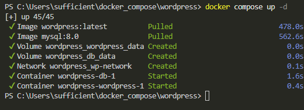
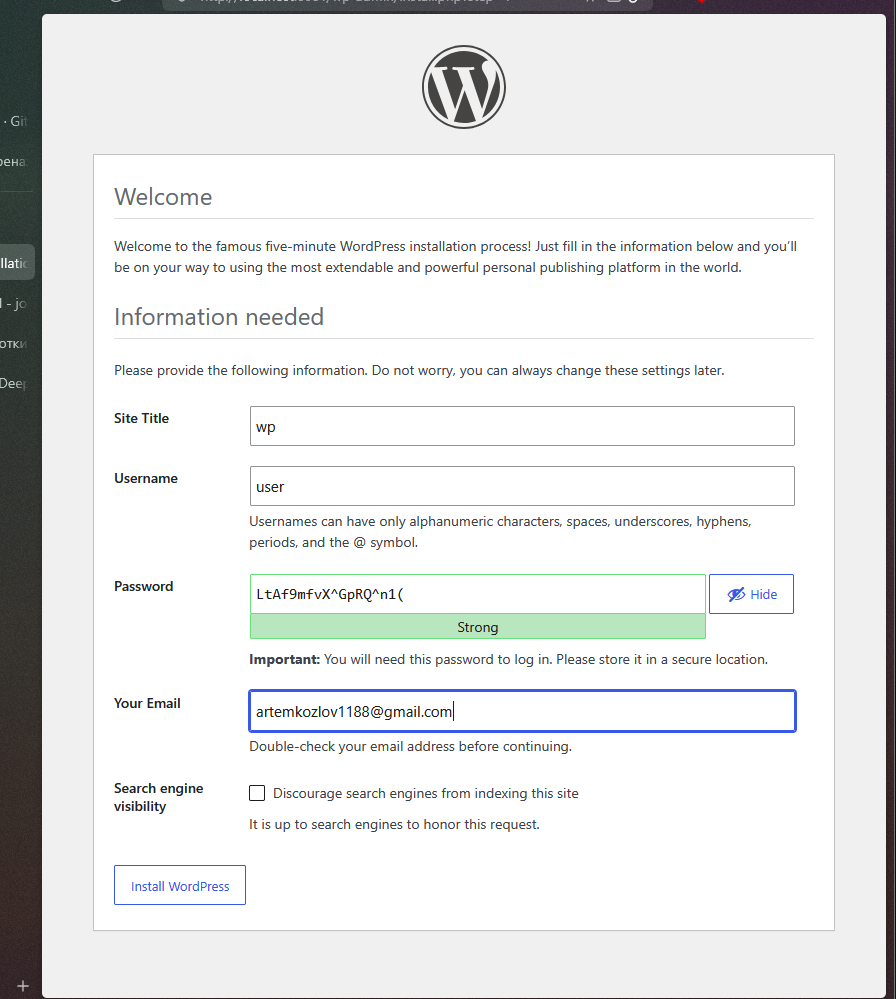
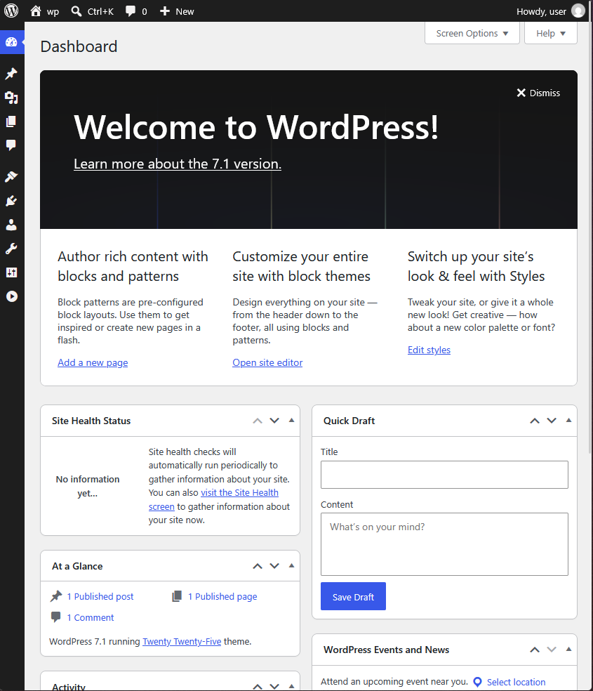

# Отчёт о выполнении практической работы

<div align="center">

## Docker Compose проект с WordPress

**Выполнил:** _[Козлов Артем]_
**Группа:** _[Ипо8482]_

</div>

---

## 1️⃣ Запуск проекта

```shell
docker compose up -d
```

Проверка статуса контейнеров:

```shell
docker compose ps -a
```

> 📸 **Скриншот 1 — запуск контейнеров и их статус (оба контейнера `wordpress` и `db` в статусе Up):**



---

## 2️⃣ Установка WordPress через веб-установщик

Открыл в браузере адрес: [http://localhost:8081](http://localhost:8081)

> 📸 **Скриншот 2 — мастер установки WordPress:**




---

## 3️⃣ Проверка работы сайта и админ-панели

> 📸 **Скриншот 4 — панель администратора WordPress:**




---