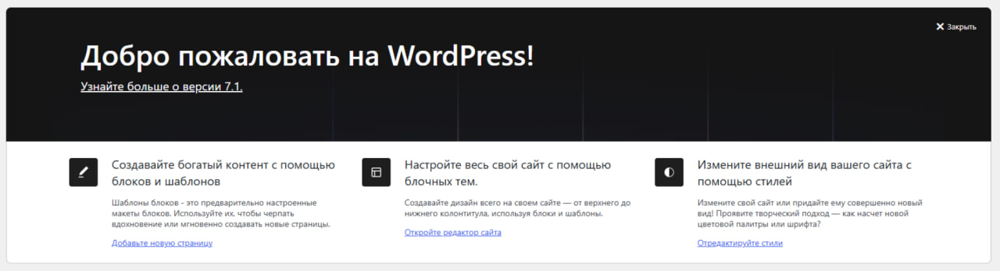

# 🐳 WordPress в Docker Compose

> Пошаговая инструкция по развёртыванию сайта на **WordPress** с базой данных **MySQL 8.0** в изолированной Docker-сети.

[](https://docs.docker.com/compose/)
[](https://wordpress.org/)
[](https://www.mysql.com/)
---

## 📑 Содержание

- [🗂️ Содержимое папки](#️-содержимое-папки)
- [⚙️ Требования](#️-требования)
- [🚀 Быстрый старт](#-быстрый-старт)
- [📋 Шаг 1. Проверка текущих контейнеров](#-шаг-1-проверка-текущих-контейнеров)
- [📝 Шаг 2. Файл compose.yaml](#-шаг-2-файл-composeyaml)
- [▶️ Шаг 3. Запуск проекта](#️-шаг-3-запуск-проекта)
- [✅ Шаг 4. Проверка статуса](#-шаг-4-проверка-статуса)
- [🌐 Шаг 5. Установка WordPress](#-шаг-5-установка-wordpress)
- [🛠️ Полезные команды](#️-полезные-команды)
- [🗑️ Удаление проекта](#️-удаление-проекта)
- [📌 Примечания](#-примечания)

---

## 🗂️ Содержимое папки

| Файл | Назначение |
|------|------------|
| `compose.yaml` | Конфигурация Docker Compose |
| `photo_2026-09-15_12-25-52.jpg` | Скриншот: установка WordPress |
| `photo_2026-09-15_12-26-02.jpg` | Скриншот: запуск `docker compose up` |
| `photo_2026-09-15_12-26-06.jpg` | Скриншот: админ-панель WordPress |
| `README.md` | 👈 Вы здесь |

## ⚙️ Требования

| Компонент | Версия |
|-----------|--------|
| Docker Engine | 20.10+ |
| Docker Compose | v2 (`docker compose`) |
| Свободный порт | `8081` |

## 🚀 Быстрый старт

```bash
# из папки grrrmonday
docker compose up -d
```

Откройте в браузере: 👉 **http://localhost:8081**

---

## 📋 Шаг 1. Проверка текущих контейнеров

Проверьте, какие Docker Compose приложения уже запущены:

```bash
docker compose ls
```

Если есть работающие проекты, которые могут конфликтовать, остановите их:

```bash
docker compose stop
```

## 📝 Шаг 2. Файл `compose.yaml`

```yaml
services:
  db:
    image: mysql:8.0
    restart: unless-stopped
    environment:
      MYSQL_ROOT_PASSWORD: somewordpress
      MYSQL_DATABASE: wordpress
      MYSQL_USER: wordpress
      MYSQL_PASSWORD: wordpress
    volumes:
      - db_data:/var/lib/mysql
    networks:
      - wp-network

  wordpress:
    depends_on:
      - db
    image: wordpress:latest
    ports:
      - "8081:80"
    restart: unless-stopped
    environment:
      WORDPRESS_DB_HOST: db:3306
      WORDPRESS_DB_USER: wordpress
      WORDPRESS_DB_PASSWORD: wordpress
      WORDPRESS_DB_NAME: wordpress
    volumes:
      - wordpress_data:/var/www/html
    networks:
      - wp-network

networks:
  wp-network:

volumes:
  db_data:
  wordpress_data:
```

### 🔍 Что тут происходит

| Сервис | Образ | Порт | Назначение |
|--------|-------|------|------------|
| `db` | `mysql:8.0` | — | База данных |
| `wordpress` | `wordpress:latest` | `8081:80` | Веб-приложение |

- `depends_on: db` — WordPress стартует после БД.
- `volumes` — данные переживают перезапуск контейнеров.
- `wp-network` — общая сеть, по которой WordPress видит БД как `db:3306`.

## ▶️ Шаг 3. Запуск проекта

Из папки `grrrmonday`:

```bash
docker compose up -d
```

Дождитесь загрузки образов — это может занять несколько минут.


## ✅ Шаг 4. Проверка статуса

```bash
docker compose ps -a
```

Оба контейнера (`db` и `wordpress`) должны иметь статус **Up**.

## 🌐 Шаг 5. Установка WordPress

Перейдите в браузере по адресу:

👉 **http://localhost:8081**

Пройдите стандартную установку:

1. Выберите язык
2. Введите название сайта и данные администратора
3. Войдите в админ-панель




---

## 🛠️ Полезные команды

| Команда | Действие |
|---------|----------|
| `docker compose stop` | Остановить контейнеры |
| `docker compose start` | Запустить остановленные |
| `docker compose restart` | Перезапустить |
| `docker compose logs -f` | Логи всех сервисов в реальном времени |
| `docker compose logs -f wordpress` | Логи только WordPress |
| `docker compose logs -f db` | Логи только БД |

## 🗑️ Удаление проекта

```bash
# Остановить и удалить контейнеры (данные в томах сохранятся)
docker compose down

# Полное удаление вместе с данными (осторожно!)
docker compose down -v
```

## 📌 Примечания

- 🌐 WordPress доступен на порту **8081**
- 💾 Данные хранятся в именованных томах `db_data` и `wordpress_data`
- ⚠️ Пароли в `compose.yaml` указаны для локальной разработки — **для продакшена обязательно смените их**

---

## 📄 Лицензия
