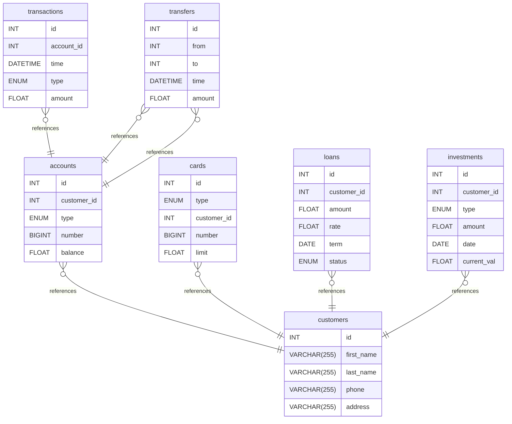

<div align="center">


# 🎨 drawDB в Docker

### *Бесплатный редактор схем БД и генератор SQL прямо в браузере*

[](https://github.com/drawdb-io/drawdb)
[](https://docs.docker.com/compose/)

</div>

---

<div align="center">

```
╔══════════════════════════════════════════════════════════════╗
║                                                              ║
║   📥  GIT CLONE   ────►   🐳  DOCKER UP   ────►   🌐  WEB    ║
║                                                              ║
║   Скачиваем       ────►   Запускаем       ────►   Рисуем     ║
║   репозиторий            контейнер               схему БД    ║
║                                                              ║
╚══════════════════════════════════════════════════════════════╝
```

</div>

---

## 🎴 О проекте

<table>
<tr>
<td width="50%" valign="top">

### 🎨 Что такое drawDB?

**DrawDB** — бесплатный, простой и интуитивно понятный **редактор схем баз данных** и **генератор SQL** прямо в браузере.

- ✏️ Рисуете ER-диаграммы мышкой
- 🧠 Экспортируете в SQL автоматически
- 🌍 Работает прямо в браузере
- 🆓 Полностью бесплатно

</td>
<td width="50%" valign="top">

### 🔗 Полезные ссылки

- 🌐 **GitHub-репозиторий:** [drawdb-io/drawdb](https://github.com/drawdb-io/drawdb)
- 📖 **Документация:** [drawdb-io.github.io](https://drawdb-io.github.io/)
- 🐳 **Docker Hub:** [drawdb/community](https://hub.docker.com/)

</td>
</tr>
</table>

---

## 🚦 Пре-флайт проверка

> 🛑 **СТОП!** Перед запуском убедитесь, что **свободен порт `5173`**.

```shell
docker compose ls
```

> 💡 **Совет:** Остановите лишние контейнеры — меньше конфликтов за порты.

---

## 🗺️ Карта путешествия

<div align="center">

|  | Шаг | Действие | Время |
|:-:|:---:|:---|:---:|
| 📥 | **1** | [Получить drawDB из аппстрима](#-шаг-1-получение-drawdb-из-аппстрима) | ~30 сек |
| 🚀 | **2** | [Запустить drawDB локально](#-шаг-2-установка-и-запуск-drawdb-локально) | ~2 мин |
| 🎨 | **3** | [Нарисовать схему](#-бонус-пример-er-диаграммы) | ∞ |
| 🗑️ | **4** | [Удалить проект](#-шаг-3-удалить-проект) | ~30 сек |

</div>

---

## 📥 Шаг 1. Получение drawDB из аппстрима

> 🧭 **Аппстрим (appstream)** — автор-разработчик, предоставляющий единую инфраструктуру для описания своего программного обеспечения.

### 📂 Клонируем репозиторий

> 💡 Клонируйте в корень домашней папки текущего пользователя (`cd ~`).

```shell
git clone https://github.com/drawdb-io/drawdb
```

### 📁 Переходим в папку проекта

```shell
cd drawdb/
```

---

## 🚀 Шаг 2. Установка и запуск drawDB локально

### ▶️ Запускаем проект

```shell
docker compose up -d
```

> ⚙️ `-d` — фоновый режим (detached).

### 🔍 Проверяем, что проект запущен

```shell
docker compose ls
```

> ⏳ **Внимание!** Проекту нужно несколько минут для запуска контейнера. Подождите немного, прежде чем открыть его в браузере.

<div align="center">

### 🌐 [Открыть drawDB локально → http://localhost:5173](http://localhost:5173)

</div>

### 📸 Скриншот

<div align="center">


</div>

---

## 🗑️ Шаг 3. Удалить проект

### 🔧 Детальный способ

<details open>
<summary><b>1️⃣ Остановить контейнер с удалением данных</b></summary>

```shell
docker compose down -v
```

</details>

<details open>
<summary><b>2️⃣ Проверить, не запущен ли удаляемый контейнер</b></summary>

```shell
docker ps -a
```

и

```shell
docker compose ps -a
```

</details>

<details open>
<summary><b>3️⃣ Получить id образа</b></summary>

```shell
docker images
```

</details>

<details open>
<summary><b>4️⃣ Удалить образ</b></summary>

```shell
docker rmi id-образа
```

</details>

<details open>
<summary><b>5️⃣ Удалить каталог проекта</b></summary>

```shell
rm -rf drawdb
```

</details>

---

### ⚡ Упрощённый способ удаления

<div align="center">

```
   ┌───────────────────────────────┐
   │  🛑 docker compose down       │  ← Остановить + удалить всё
   │      --rmi all -v             │
   └──────────────┬────────────────┘
                  ▼
   ┌───────────────────────────────┐
   │  🚪 cd ..                     │  ← Выйти из папки
   └──────────────┬────────────────┘
                  ▼
   ┌───────────────────────────────┐
   │  🧹 rm -rf drawdb             │  ← Удалить каталог
   └───────────────────────────────┘
```

</div>

**1️⃣ Остановить и удалить контейнер с данными**

```shell
docker compose down --rmi all -v
```

**2️⃣ Выйти из каталога**

```shell
cd ..
```

**3️⃣ Удалить каталог проекта**

```shell
rm -rf drawdb
```

---

## 🎨 Бонус: пример ER-диаграммы

> 🧪 Пример экспортированной ER-диаграммы, которую можно построить в **drawDB**. Показывает взаимосвязи между банковскими сущностями.



### 🔍 Что показывает диаграмма

| 🧩 Сущность | 📌 Описание |
|:---|:---|
| 👤 `customers` | Клиенты банка |
| 💳 `accounts` | Счета клиентов |
| 💸 `transactions` | Транзакции по счетам |
| 🔁 `transfers` | Переводы между счетами |
| 💰 `cards` | Банковские карты |
| 🏦 `loans` | Кредиты |
| 📈 `investments` | Инвестиции |

---

<div align="center">

## 🎉 Готово!

Теперь вы умеете:

📥 &nbsp; Клонировать **drawDB** из аппстрима<br>
🐳 &nbsp; Запускать проект в **Docker**<br>
🎨 &nbsp; Рисовать **ER-диаграммы** в браузере<br>
🗑️ &nbsp; Чисто удалять контейнеры и образы

---

### ⭐ Если проект был полезен — поставьте звезду оригинальному репозиторию!

> 📝 *Если вы обнаружили ошибку в этом тексте — сообщите, пожалуйста, автору!*

**Сделано с 🎨 и ❤️ для удобной работы с базами данных**

</div>
