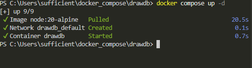
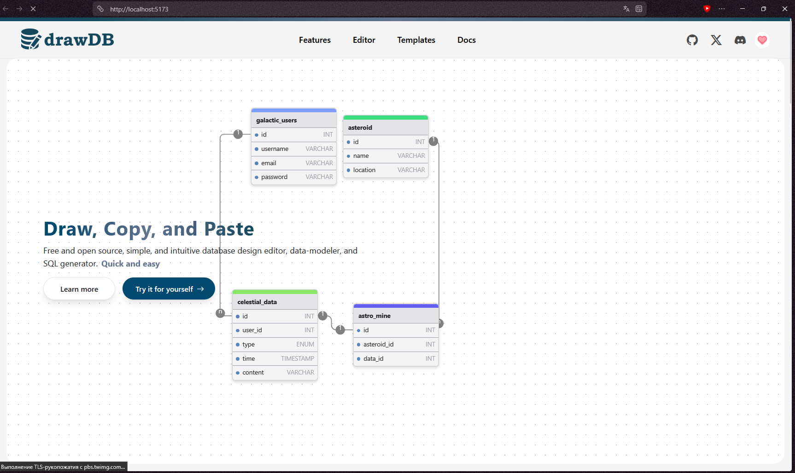

# Отчёт о выполнении практической работы

<div align="center">

## Docker Compose проект с drawDB

**Выполнил:** _[Козлов Артем]_
**Группа:** _[Ипо8482]_

</div>

---

## 1️⃣ Клонирование репозитория

```shell
git clone https://github.com/drawdb-io/drawdb
```

```shell
cd drawdb/
```


---

## 2️⃣ Запуск проекта

```shell
docker compose up -d
```

Проверка запуска:

```shell
docker compose ls
```

> 📸 **Скриншот 2 — запуск контейнера drawDB:**



---

## 3️⃣ Работа с drawDB в браузере

Открыл в браузере адрес: [http://localhost:5173/](http://localhost:5173/)

> 📸 **Скриншот 3 — интерфейс drawDB в браузере:**


