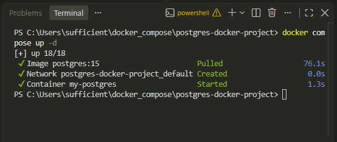
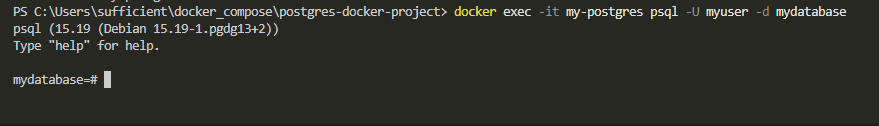

# Отчёт о выполнении практической работы

<div align="center">

## Docker Compose контейнеры с PostgreSQL

**Выполнил:** _[Козлов Артем]_
**Группа:** _[Ипо8482]_

</div>

---

## 1️⃣ Запуск проекта

```shell
docker compose up -d
```

Проверка состояния контейнера:

```shell
docker compose ps
```

> 📸 **Скриншот 1 — запуск контейнера и его статус (контейнер `my-postgres` в статусе Up):**



---

## 2️⃣ Подключение к базе данных

Подключение к БД внутри контейнера:

```shell
docker exec -it my-postgres psql -U myuser -d mydatabase
```

> 📸 **Скриншот 2 — подключение к PostgreSQL и проверка созданных таблиц/данных:**



---

## 3️⃣ Просмотр логов контейнера

```shell
docker compose logs postgres
```

