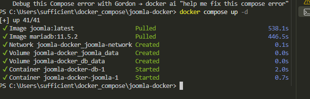
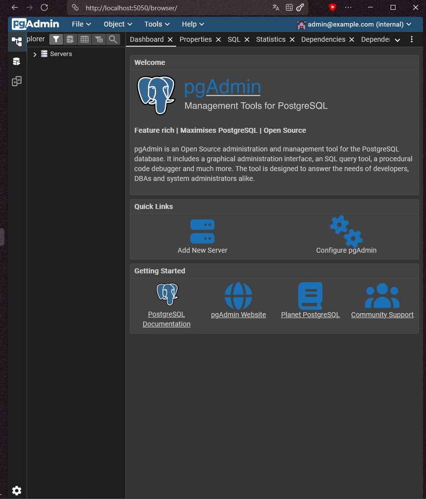
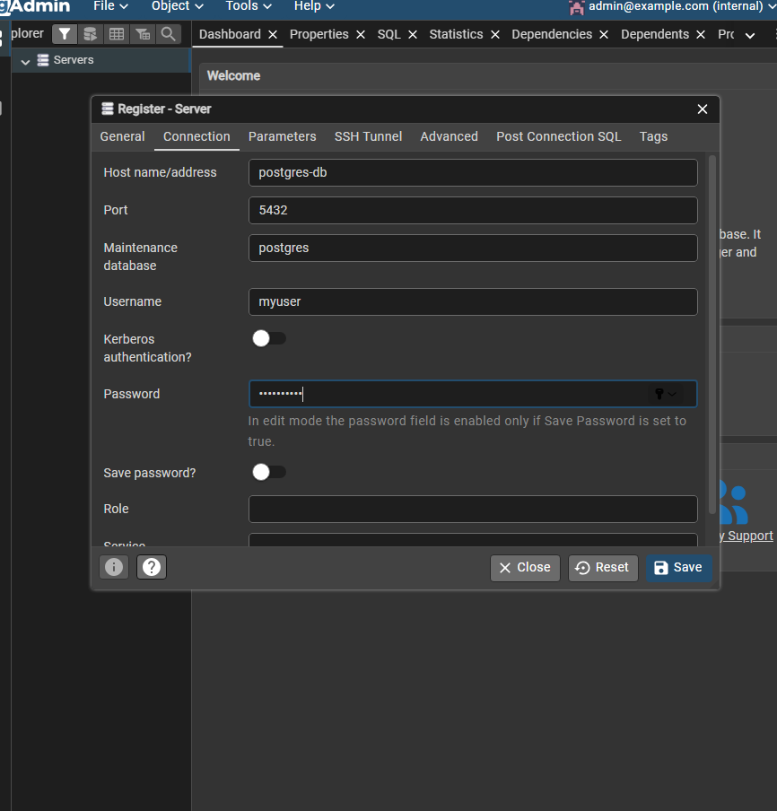

# Отчёт о выполнении практической работы

<div align="center">

## Docker Compose контейнеры с PostgreSQL + pgAdmin

**Выполнил:** _[Козлов Артем]_
**Группа:** _[Ипо8482]_

</div>

---

##  Запуск проекта

```shell
docker compose up -d
```

Проверка статуса контейнеров:

```shell
docker compose ps -a
```

> 📸 **Скриншот 1 — запуск контейнеров и их статус (оба контейнера `postgres` и `pgadmin` в статусе Up):**



---

---

##  Подключение pgAdmin к PostgreSQL

В настройках подключения указал:
- **Host name/address:** `postgres-db`
- **Port:** `5432`
- **Maintenance database:** `mydatabase`
- **Username:** `myuser`
- **Password:** `mypassword`


> 📸 **Скриншот 4 — успешное подключение и просмотр базы данных в pgAdmin:**



---

## 4️⃣ Просмотр логов контейнеров

```shell
docker compose logs -f postgres
```

```shell
docker compose logs -f pgadmin
```
