## Практическая работа на примере готового образа Apache (httpd) в Docker

> **Apache HTTP Server** (в Docker-образах обычно идёт как `httpd`) — популярный веб‑сервер.
>
> Никогда в разработке не используйте русские имена файлов и каталогов!
> Никогда в разработке не используйте пробелы и спец.символы в именах файлов и каталогов!

## Этапы

### 1. Проверить Docker

Получить версию установленного у вас Docker:

```shell
docker version
```

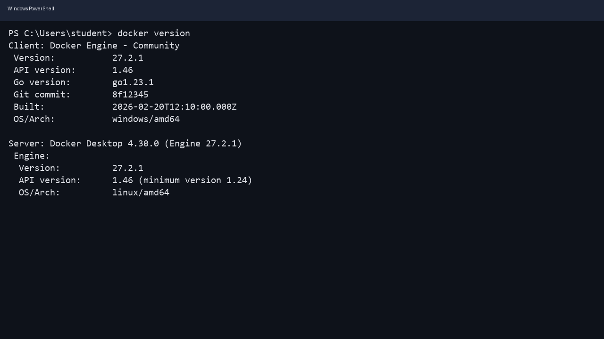

### 2. Подготовка Docker (чтобы начать работать с "чистого листа")

Проверьте, нет ли у вас уже установленных/запущенных контейнеров:

```shell
docker ps -a
```

Если есть учебные контейнеры, которые не жалко удалить:

```shell
docker stop $(docker ps -q)
docker container prune
```

Опционально (осторожно) почистить неиспользуемые образы:

```shell
docker image prune -a
```

> Удаляйте только учебные контейнеры/образы: в контейнерах могут храниться важные данные!

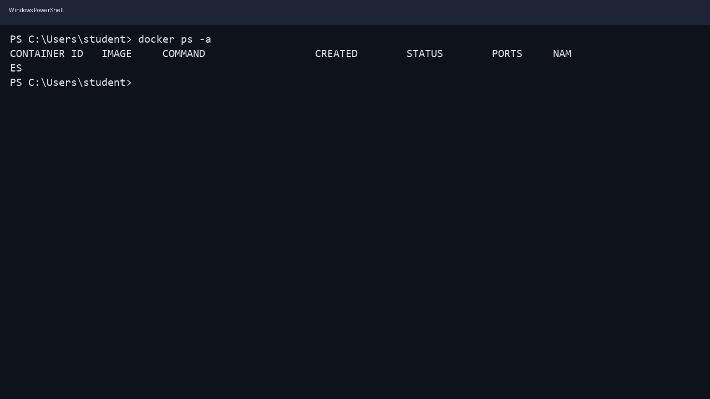

### 3. Получение готового образа Apache (httpd) и запуск контейнера

Найти образ:

```shell
docker search httpd
```

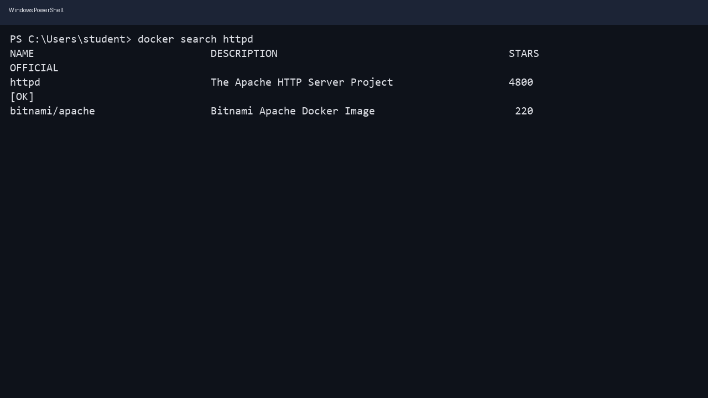

Создать и запустить контейнер (проброс порта \(локальный 8081 → контейнерный 80\)):

```shell
docker run -d --name my-apache -p 8081:80 httpd
```

Если контейнер с таким именем уже существует, посмотрите список и удалите/переименуйте:

```shell
docker ps -a
docker rm my-apache
```

Проверить, что образ скачался и контейнер запущен:

```shell
docker images
docker ps
```

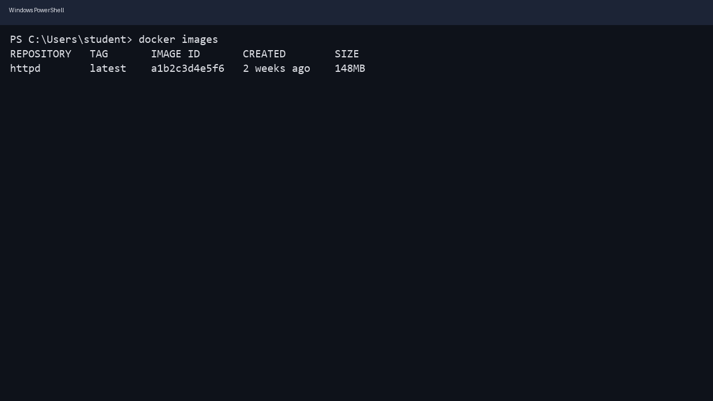
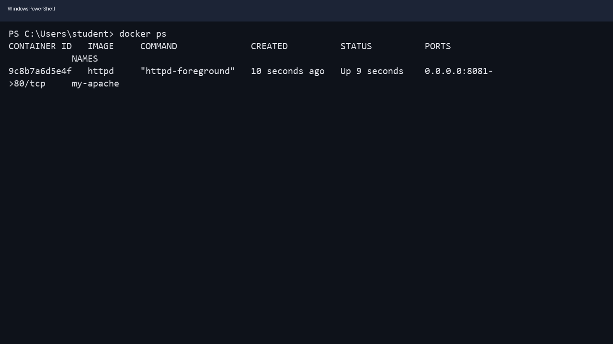

### 4. Проверить работу Apache

Способ 1 (через curl):

```shell
curl http://localhost:8081/
```

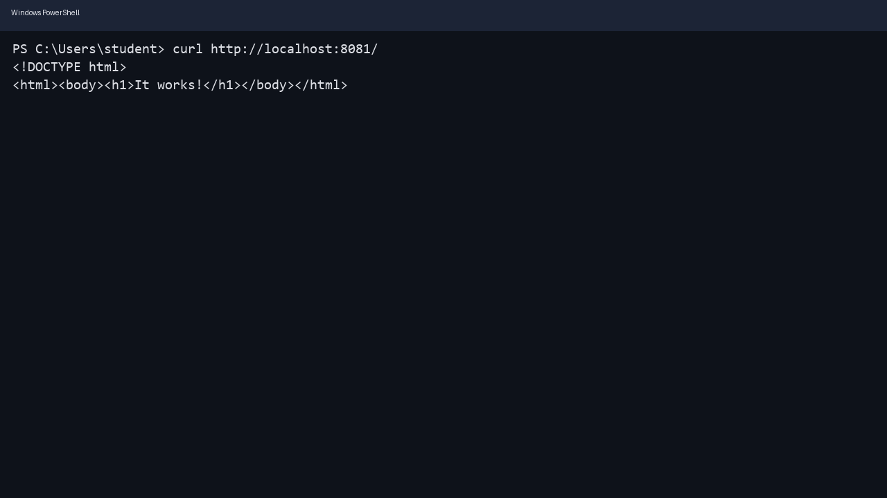

Способ 2 (в браузере):

[Откройте страницу http://localhost:8081/](http://localhost:8081/)

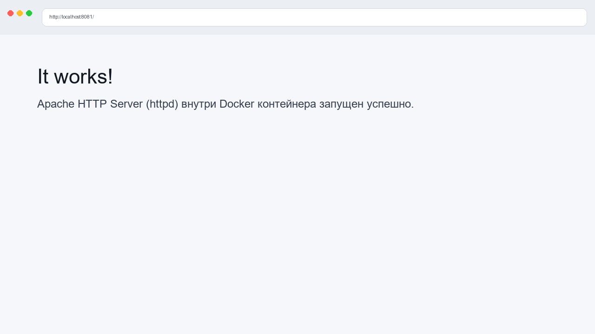

### 5. Мониторинг и логи контейнера

Посмотреть подробности контейнера:

```shell
docker inspect my-apache
```

Посмотреть статистику:

```shell
docker stats
```

> Выйти можно по `Ctrl+C`

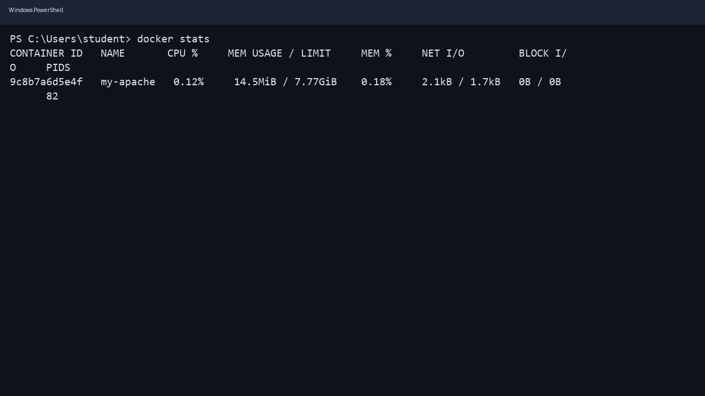

Посмотреть логи:

```shell
docker logs my-apache
```

Логи в режиме ожидания:

```shell
docker logs -f my-apache
```

> Выйти можно по `Ctrl+C`

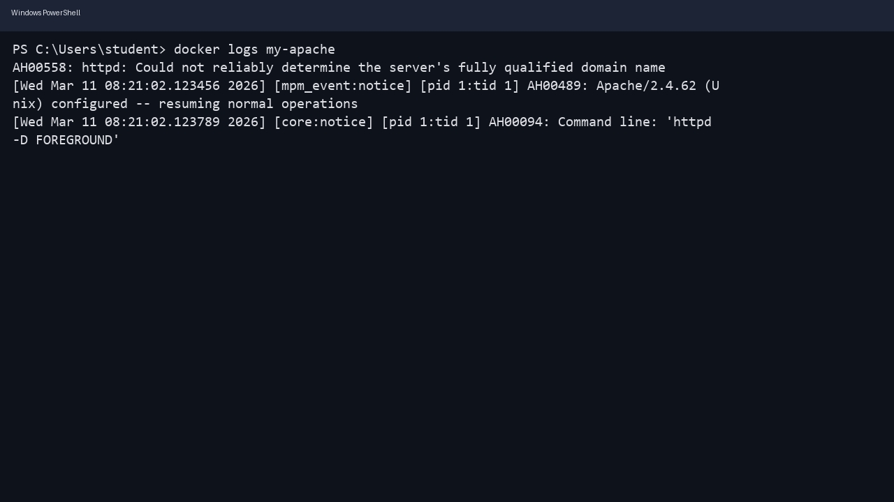

### 6. Зайти в контейнер и изменить страницу

Зайти внутрь контейнера:

```shell
docker exec -it my-apache /bin/bash
```

Если bash недоступен, используйте:

```shell
docker exec -it my-apache /bin/sh
```

Проверить, что Apache отдаёт файлы из каталога `htdocs`:

```shell
ls -la /usr/local/apache2/htdocs
```

Установить редактор `micro` (в контейнере на Debian/Ubuntu‑подобной базе):

```shell
apt update && apt install -y micro
```

Открыть `index.html` для редактирования:

```shell
micro /usr/local/apache2/htdocs/index.html
```

Сохранить по `Ctrl+S`, выйти по `Ctrl+Q`, затем выйти из контейнера:

```shell
exit
```

Обновите страницу в браузере \(F5 / Ctrl+R\) и зафиксируйте результат:

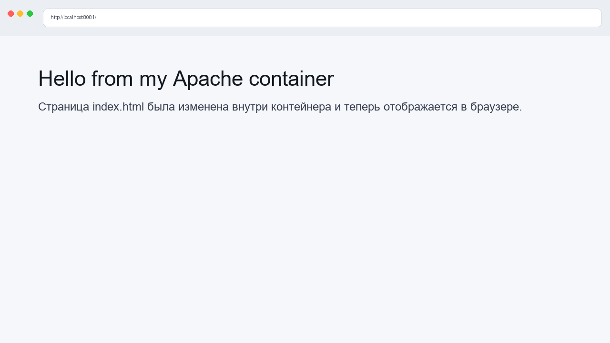

### 7. Вариант “по‑взрослому”: подмонтировать свою страницу с хоста (volume)

Создайте локальную папку (пример пути — поменяйте под себя) и файл `index.html`:

```shell
mkdir apache_site
```

Далее создайте `apache_site/index.html` любым редактором и положите туда простой HTML.

Остановить и удалить текущий контейнер:

```shell
docker stop my-apache
docker rm my-apache
```

Запустить Apache так, чтобы он раздавал ваш `index.html` с компьютера:

```shell
docker run -d --name my-apache -p 8081:80 -v "$(pwd)/apache_site:/usr/local/apache2/htdocs" httpd
```

Проверьте изменения в браузере:

[http://localhost:8081/](http://localhost:8081/)

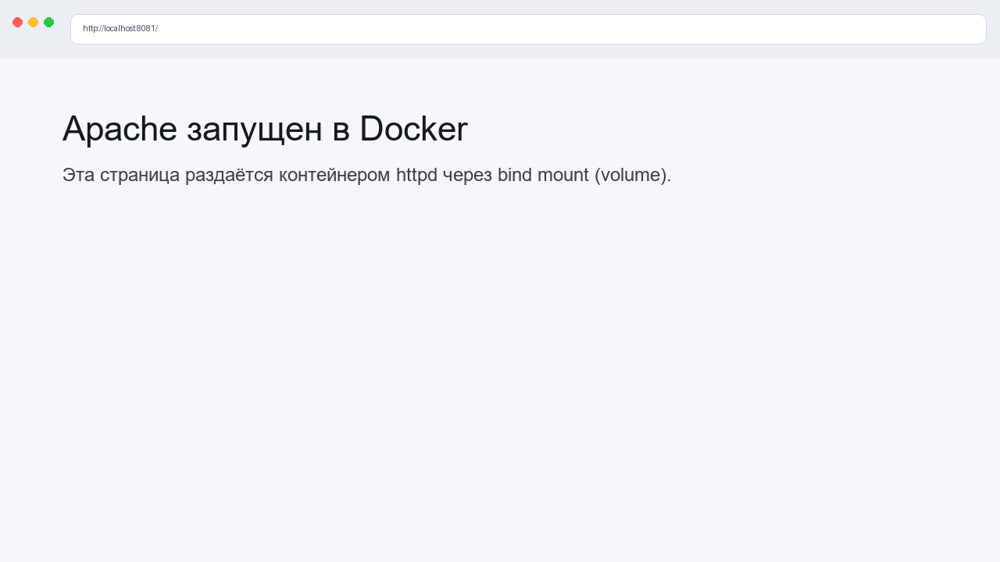

### 8. Остановка и удаление (очистка после работы)

Остановить контейнер:

```shell
docker stop my-apache
```

Удалить контейнер:

```shell
docker rm my-apache
```

Опционально удалить образ `httpd`:

```shell
docker images
docker rmi httpd
```

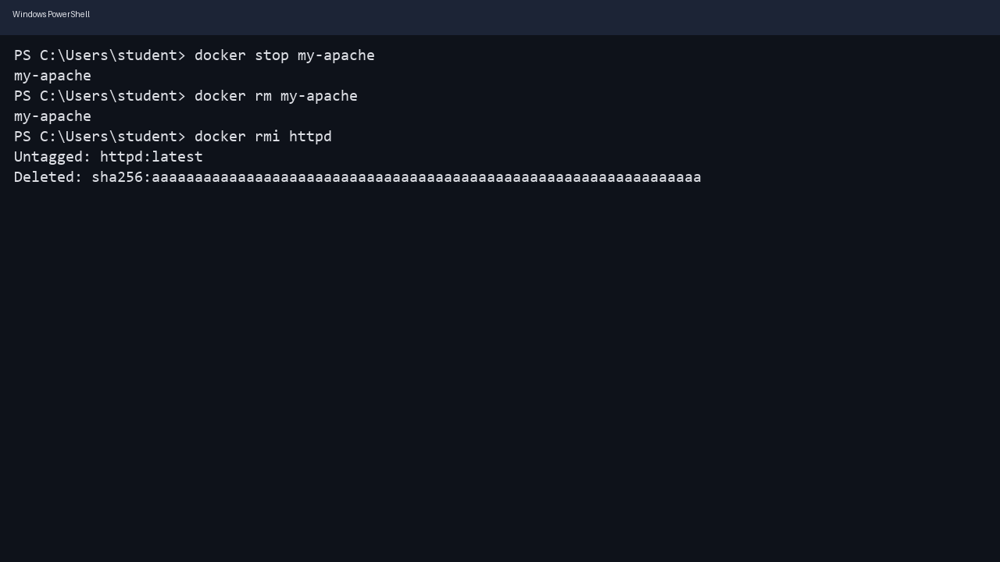

